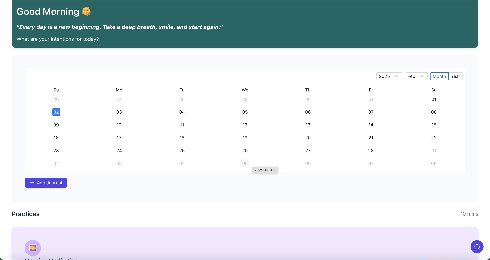

# Dost-Bot

Dost-Bot is a journal-taking web application integrated with an AI-powered chatbot that provides sentiment analysis and thoughtful responses to user entries. It is helpful in personalizing with the user and can act as a friend to the user in time of needs. Just like we share our day to day conversation with our friends, through dost bot, share your experiences and love the have a chat with it.

## Features
- ✍️ **Journal Writing** – Add, view, and manage journal entries.
- 📅 **Calendar Integration** – View past entries on a calendar.
- 🤖 **AI Chatbot** – Chat with an AI assistant for guidance and emotional support.
- 🎨 **Beautiful UI** – A user-friendly, colorful design with an uplifting experience.
- ☁️ **Cloud-Hosted Backend** – Built with a scalable API.

## Images



## Demonstration

[text](<Screen Recording 2025-02-02 at 1.11.32 PM.mov>)

## Tech Stack
- **Frontend**: React, Ant Design, Tailwind CSS
- **Backend**: FastAPI, Python
- **Bot**: Huggingface, google/flan-t5-large model

## Installation
### Prerequisites
- Node.js & npm
- Python 3
- Git

### Setup Frontend
```sh
cd dost-bot-frontend
npm install
npm start
```

### Setup Backend
```sh
pip install -r requirements.txt
uvicorn backend:app --reload
```

## Deployment
### Frontend Deployment (Vercel/Netlify)
```sh
npm run build
```
Upload the `build/` directory to Vercel or Netlify.

## Usage
1. **Run the app** and open `http://localhost:3000/`.
2. **Start journaling** and interact with the AI.
3. **Use the chat feature** for responses based on your entries.


---
Made with ❤️ by Dost-Bot Team.
